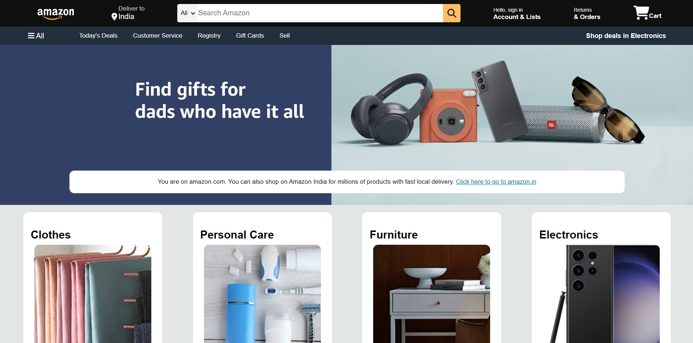

# Basic Amazon Frontend Clone



Welcome to the Basic Amazon Frontend Clone project! This repository contains a simple web application built using HTML and CSS, designed to resemble the frontend of the Amazon website. This project serves as a hands-on exercise to improve your HTML and CSS skills by recreating the design elements of a popular e-commerce platform.

## Features

- **Familiar Design:** Explore a user interface reminiscent of the Amazon website, including the navigation bar, product listings, and footer.

- **Responsive Layout:** The clone is designed not to be responsive, adapting to various screen sizes to provide a consistent user experience across devices.

- **Product Listings:** Display various product listings with placeholder images, titles, prices, and ratings.

- **Navigation Bar:** Mimic the Amazon navigation bar, complete with a search bar and links to different sections of the website.

- **Footer:** Replicate the Amazon footer containing links to different pages, policies, and social media handles.

## Getting Started

1. Clone the repository to your local machine.
   ```sh
   git clone https://github.com/yourusername/basic-amazon-clone.git
2. Open the index.html file in your preferred web browser to view the clone.
3. Explore and modify the HTML and CSS files to experiment with the design and layout.

## Tutorial Reference

This project was created as part of the "[Amazon Clone](https://www.youtube.com/watch?v=nGhKIC_7Mkk&pp=ygUMYW1hem9uIGNsb25l)" tutorial by [Shradha Khapra](https://in.linkedin.com/in/shradha-khapra) on YouTube. The tutorial provides step-by-step guidance on building a basic Amazon frontend clone using HTML and CSS.

## Contributing

Contributions are welcome! If you have any ideas for improvements or additional features, feel free to submit a pull request. Please make sure to follow best practices and maintain the project's simplicity and focus on HTML and CSS.

## License

This project is licensed under the [MIT License](https://en.wikipedia.org/wiki/MIT_License).

## Acknowledgments

This project was inspired by the [Amazon](https://www.amazon.in/) website.
Thanks to the open-source community for their invaluable resources and tutorials on HTML and CSS.
Feel free to reach out with any questions or suggestions. 

### Happy coding!
